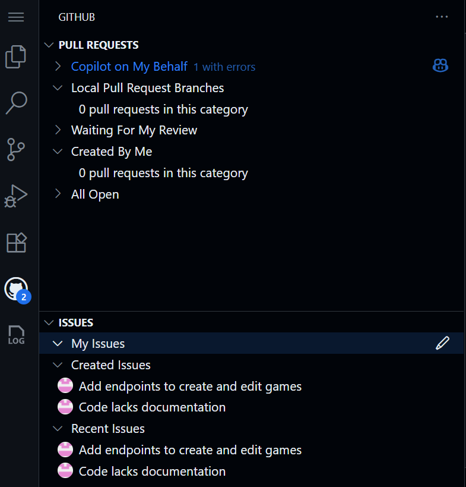

# 練習 2 - 使用 Copilot 代理模式和 GitHub MCP 伺服器設定待辦事項

| [← 上一課：GitHub Copilot 編碼代理][previous-lesson] | [下一課：自定義指令 →][next-lesson] |
|:--|--:|

編寫程式碼不只是編寫程式碼。需要提交議題、呼叫外部服務，並收集資訊。通常這涉及與外部工具互動，這可能會打斷開發者的流程。透過模型上下文協定 (MCP) 的力量，您可以直接從 Copilot 存取所有這些功能！

## 情境

您是 Tailspin Toys 的兼職開發者 - 一個以開發者為主題的桌上遊戲眾籌平台。您已被分配各種任務來為網站引入新功能。作為一個好的團隊成員，您想要提交議題來追蹤您的工作。為了幫助未來的您，您決定尋求 Copilot 的幫助。您將使用 GitHub Copilot Chat 代理模式和 GitHub 模型上下文協定 (MCP) 伺服器為您建立議題，來設定實驗其餘部分的工作待辦事項。

為了實現這個目標，您將：

- 使用模型上下文協定 (MCP)，它提供對外部工具和功能的存取。
- 在您的存儲庫中設定 GitHub MCP 伺服器。
- 使用 GitHub Copilot Chat 代理模式在您的存儲庫中建立議題。

在本練習結束時，您將建立一個 GitHub 議題的待辦事項，供實驗其餘部分使用。

## 什麼是代理模式和模型上下文協定 (MCP)？

GitHub Copilot Chat 中的代理模式將 Copilot 轉變為一個可以代表您執行動作的 AI 代理。此模式允許您以更動態的方式與 Copilot 互動，使其能夠使用工具和執行任務，如執行測試或終端命令、從編輯器讀取問題，並使用這些見解來更新您的程式碼。這允許更互動和協作的工作流程，使您能夠在開發過程中利用 AI 的功能。

[模型上下文協定 (MCP)][mcp-blog-post] 為 AI 代理提供與外部工具和服務通訊的方式。透過使用 MCP，AI 代理可以即時與外部工具和服務通訊。這使他們能夠存取最新資訊（使用資源）並代表您執行動作（使用工具）。

這些工具和資源透過 MCP 伺服器存取，它充當 AI 代理和外部工具和服務之間的橋樑。MCP 伺服器負責管理 AI 代理和外部工具（如現有 API 或本地工具如 NPM 套件）之間的通訊。每個 MCP 伺服器代表 AI 代理可以存取的不同工具和資源集合。


流行的現有 MCP 伺服器包括：

- **[GitHub MCP 伺服器][github-mcp-server]**：此伺服器提供對一組用於管理您的 GitHub 存儲庫的 API 的存取。它允許 AI 代理執行創建新存儲庫、更新現有存儲庫，以及管理議題和拉取請求等動作。
- **[Playwright MCP 伺服器][playwright-mcp-server]**：此伺服器使用 Playwright 提供瀏覽器自動化功能。它允許 AI 代理執行導覽到網頁、填寫表單和點擊按鈕等動作。
- **其他參考伺服器**：還有許多其他 MCP 伺服器可用，提供對不同工具和資源的存取。Anthropic 有 [MCP 伺服器清單][anthropic-mcp-servers]，包括參考、第三方和社群實作。

> [!IMPORTANT]
> 關於安全性，將 MCP 伺服器視為專案中的任何其他相依性。在使用 MCP 伺服器之前，仔細審查其原始碼，驗證發佈者，並考慮安全隱患。只使用您信任的 MCP 伺服器，並對授予敏感資源或操作的存取權限保持謹慎。

## 確保您的 codespace 準備就緒

在[先前的練習][prereqs-lesson]中，您啟動了將用於本實驗其餘編碼練習的 codespace。在我們開始使用之前，讓我們對其進行最後的設定。

codespace 的設定過程安裝和設定了許多 [VS Code 擴充功能][vscode-extensions]。與任何軟體一樣，可能需要更新。當您的 codespace 建立時，我們需要確保一切都是最新的。

1. 返回到您啟動 codespace 的標籤頁。如果您關閉了標籤頁，返回到您的存儲庫，選擇 **Code** > **Codespaces**，然後選擇 codespace 的名稱。
2. 在 codespace 左側的工作台上選擇 **Extensions**。

    

3. 在任何有 **Update** 按鈕的擴充功能上選擇 **Update**。根據需要重複執行。
4. 在任何有 **Reload Window** 按鈕的擴充功能上選擇 **Reload Window** 來重新載入 codespace。
5. 當出現對話框時，選擇 **Reload** 來重新載入視窗。這將確保正在使用最新版本。

## 使用 GitHub Copilot Chat 和代理模式

要存取 GitHub Copilot Chat 代理模式，您需要在 IDE 中安裝 GitHub Copilot Chat 擴充功能，如果您使用的是 GitHub Codespace，這應該已經是如此。

> [!TIP]
> 如果您沒有安裝 GitHub Copilot Chat 擴充功能，您可以[從 Visual Studio Code Marketplace 安裝它][copilot-chat-extension]。或者在 Visual Studio Code 中打開擴充功能檢視，搜尋 **GitHub Copilot Chat**，然後選擇 **Install**。

一旦安裝了擴充功能，您可能需要使用您的 GitHub 帳戶進行驗證來啟用它。

1. 返回您的 codespace。
2. 在您的 codespace 頂部選擇 **Copilot Chat** 圖示。
3. 在 Copilot Chat 視窗中輸入類似「Hello world」的訊息，然後按 enter。這應該會啟動 Copilot Chat。
4. 另外，如果您沒有經過驗證，系統會提示您登入您的 GitHub 帳戶。按照指示進行驗證。

    

5. 驗證後，您應該會看到 Copilot Chat 視窗出現。

6. 透過選擇 Copilot Chat 視窗中的下拉選單並選擇 **Agent** 來切換到代理模式。

    

7. 將模型設定為 **Claude Sonnet 4**。

    

> [!IMPORTANT]
> 本實驗的作者並不表示對某個模型的偏好。在建立本實驗時，我們使用了 Claude Sonnet 4，因此將其包含在指令中。希望您收到的程式碼建議與您在實驗中看到的相對一致，以確保良好的體驗。但是，因為 LLM 是機率性的，您可能會注意到收到的建議與實驗中指示的不同。這是完全正常和預期的。

8. 聊天窗格應該更新以指示您現在處於代理模式。您應該會在與您之前使用的模式和模型同一行上看到一個工具圖示，顯示我們可以為 GitHub Copilot 配置要使用的工具。

通常，在設定新專案時，可用工具的數量將設定為 0，因為我們還沒有配置任何 MCP 伺服器。但為了幫助您開始，我們已經建立了一個 **.vscode/mcp.json** 檔案，其中包含 [GitHub MCP 伺服器][github-mcp-server] 的範例配置。讓我們接下來探索一下。

## 設定 GitHub MCP 伺服器

**.vscode/mcp.json** 檔案用於配置在此 Visual Studio Code 工作區中可用的 MCP 伺服器。MCP 伺服器提供對外部工具和資源的存取，GitHub Copilot 可以使用這些工具和資源代表您執行動作。

1. 在您的存儲庫中打開 **.vscode/mcp.json** 檔案。
2. 您應該會看到類似以下的 JSON 結構：

    ```json
    {
      "servers": {
        "github": {
          "type": "http",
          "url": "https://api.githubcopilot.com/mcp/"
        }
      }
    }
    ```

此配置為 GitHub Copilot 提供對幾個額外工具的存取，使其能夠與 GitHub 存儲庫、議題、拉取請求等互動。此特定配置使用[遠端 GitHub MCP 伺服器][remote-github-mcp-server]。透過使用此方法，我們不需要擔心在本地執行 MCP 伺服器（以及相關的管理，如保持其最新），我們可以使用 OAuth 2.0 而不是個人存取權杖 (PAT) 來向遠端伺服器進行驗證。

MCP 伺服器配置定義在 **mcp.json** 檔案的 **servers** 區段中。每個 MCP 伺服器都由唯一名稱（在此案例中為 github）和其類型（在此案例中為 **http**）定義。使用本地 MCP 伺服器時，類型可能是 **stdio** 並有 **command** 和 **args** 欄位來指定如何啟動 MCP 伺服器。您可以在 [VS Code 文件][vscode-mcp-config] 中找到有關配置格式的更多資訊。在某些配置中（不適用於使用 OAuth 的遠端 GitHub MCP 伺服器），您可能還會看到 **inputs** 區段。這定義了 MCP 伺服器可能需要的任何輸入（如敏感權杖）。您可以在 [VS Code 文件][vscode-mcp-config] 中閱讀有關配置屬性的更多資訊。

要利用 MCP 伺服器，它需要被「啟動」。這將允許 GitHub Copilot 與伺服器通訊並執行您請求的任務。

> [!NOTE] 確切的驗證流程可能會有一些變化。

1. 在 VS Code 中，打開 **.vscode/mcp.json**。
2. 要啟動 GitHub MCP 伺服器，選擇 GitHub 伺服器上方的 **Start**。

    

3. 您應該會看到一個彈出視窗，要求您向 GitHub 進行驗證。

    

4. 在您用於此實驗的使用者帳戶上選擇 **Continue**。

    

5. 如果出現頁面，選擇 **Authorize visual-studio-code** 以允許 GitHub MCP 伺服器以您選擇的使用者帳戶登入。完成後，頁面應該會顯示「您現在可以關閉視窗。」。

    

6. 導覽回 GitHub Codespace 後，您應該會看到 GitHub MCP 伺服器已啟動。您可以在兩個地方檢查這一點：
    - **.vscode/mcp.json** 中之前顯示 start 的行現在應該呈現幾個選項，並顯示可用工具的數量。 
    - 選擇 Copilot Chat 窗格中的工具圖示以查看可用的工具。向下滾動出現在螢幕頂部的清單，您應該會看到來自 GitHub MCP 伺服器的工具清單。

就是這樣！您現在可以在代理模式中使用 Copilot Chat 來建立議題、管理拉取請求等等。

## 建立任務待辦事項

現在您已經設定了 GitHub MCP 伺服器，您可以使用 Copilot 代理模式建立一個任務待辦事項，供實驗其餘部分使用。

1. 返回到 Copilot Chat 窗格。確保選擇了 **Agent** 模式和 **Claude Sonnet 4** 模型。

2. 輸入或貼上以下提示來建立我們將在實驗中使用的議題：

    ```markdown
    在我的 GitHub 存儲庫中，為我們的 Tailspin Toys 待辦事項建立 GitHub 議題。每個議題應包括：
    - 清晰的標題
    - 簡要的任務描述以及為什麼它對專案很重要
    - 驗收標準的複選框清單

    從我們最近的規劃會議中，即將到來的待辦事項包括以下任務：

    1. 允許使用者按類別和發佈商過濾遊戲
    2. 在自定義指令檔案中更新我們的存儲庫編碼標準（包括關於 Python 格式化和文件字串的規則）
    3. 延伸目標：在遊戲清單頁面上實作分頁
    ```

3. 按 <kbd>enter</kbd> 或選擇 **Send** 按鈕將提示發送給 Copilot。
4. GitHub Copilot 應該處理請求並回應一個對話框，要求您確認建立議題。

    

> [!IMPORTANT]
> 請記住，AI 可能會出錯，所以請確保在確認之前審查議題。

5. 在 **Run open new issue** 框中選擇 **see more** 以查看將要建立的議題詳情。
6. 確保議題的 **owner** 和 **repo**、**title** 和 **body** 詳情看起來正確。您可以透過雙擊主體並用正確資訊更新內容來進行任何所需的編輯。
7. 審查生成的內容後，選擇 **Continue** 來建立議題。

    

8. 對其餘議題重複步驟 4-6。或者，如果您對 Copilot 自動建立議題感到滿意，您可以選擇 **Continue** 旁邊的向下箭頭並選擇 **Allow in this session** 以允許 Copilot 在此會話（當前聊天）中建立議題。

    

> [!IMPORTANT]
> 在選擇 **Allow in this session** 或類似選項之前，請確保您對 Copilot 代表您自動執行任務感到滿意。

9. 在單獨的瀏覽器標籤中，導覽到您的 GitHub 存儲庫並選擇議題標籤。
10. 您應該會看到由 Copilot 建立的議題清單。每個議題都應該包含清晰的標題和驗收標準的複選框清單。

您應該會注意到議題相當詳細。這就是我們從大型語言模型 (LLM) 和模型上下文協定 (MCP) 的力量中受益的地方，因為它已經能夠建立清晰的初始議題描述。


Tips: 可以在 GitHub Pull Requests 的界面中, 看到目前的 Pull Requests 與 Issues 狀態

## 總結與下一步

恭喜，您已經使用 Copilot Chat 和 MCP 在 GitHub 上建立了議題！

總結一下，在本練習中我們：

- 使用了模型上下文協定 (MCP)，它提供對外部工具和功能的存取。
- 在您的存儲庫中設定了 GitHub MCP 伺服器。
- 使用 GitHub Copilot Chat 代理模式在您的存儲庫中建立議題。

配置了 GitHub MCP 伺服器後，您現在可以使用 GitHub Copilot Chat 代理模式代表您執行其他動作，如建立新存儲庫、管理拉取請求以及跨存儲庫搜尋資訊。

您現在可以繼續下一個練習，您將學習如何[使用自定義指令為 Copilot 提供指導][next-lesson]，以確保程式碼是按照您組織定義的模式和實務生成的。

### 選修探索練習 - 設定 Microsoft Playwright MCP 伺服器

如果您感到冒險，可以嘗試安裝和配置另一個 MCP 伺服器，例如 [Microsoft Playwright MCP 伺服器][playwright-mcp-server]。這將允許您使用 GitHub Copilot Chat 代理模式執行瀏覽器自動化任務，如導覽到網頁、填寫表單和點擊按鈕。

您可以在 [Playwright MCP 存儲庫][playwright-mcp-server] 中找到安裝和配置 Playwright MCP 伺服器的指示。

請注意，設定過程與 GitHub MCP 伺服器類似，但您不需要提供任何憑證，如 GitHub 個人存取權杖。這是因為 Playwright MCP 伺服器不需要驗證來存取其功能。

### 使用 Agent mode + playwright mcp 工具去搜尋資料
``` bash
#playwright 幫我找 有關 github 的演講主題
https://www.digitimes.com.tw/Seminar/DevDaysAsia2025/index.html
```
### 使用 Agent mode + playwright mcp 工具, 做自動化測試
```
#playwright to test games.spec.ts and home.spec.ts
```

## 資源

- [什麼是 MCP，為什麼每個人都在談論它？][mcp-blog-post]
- [GitHub MCP 伺服器][github-mcp-server]
- [Microsoft Playwright MCP 伺服器][playwright-mcp-server]
- [Anthropic MCP 伺服器][anthropic-mcp-servers]
- [VS Code 擴充功能][vscode-extensions]
- [GitHub Copilot Chat 擴充功能][copilot-chat-extension]
- [建立細粒度個人存取權杖][github-pat-docs]

---

| [← 上一課：GitHub Copilot 編碼代理][previous-lesson] | [下一課：自定義指令 →][next-lesson] |
|:--|--:|

[previous-lesson]: ./1-copilot-coding-agent.zh-TW.md
[next-lesson]: ./3-custom-instructions.zh-TW.md
[prereqs-lesson]: ./0-prereqs.zh-TW.md
[mcp-blog-post]: https://github.blog/ai-and-ml/llms/what-the-heck-is-mcp-and-why-is-everyone-talking-about-it/
[github-mcp-server]: https://github.com/github/github-mcp-server
[playwright-mcp-server]: https://github.com/microsoft/playwright-mcp
[anthropic-mcp-servers]: https://github.com/modelcontextprotocol/servers
[vscode-extensions]: https://code.visualstudio.com/docs/configure/extensions/extension-marketplace
[copilot-chat-extension]: https://marketplace.visualstudio.com/items?itemName=GitHub.copilot
[github-pat-docs]: https://docs.github.com/en/authentication/keeping-your-account-and-data-secure/managing-your-personal-access-tokens#creating-a-fine-grained-personal-access-token
[remote-github-mcp-server]: https://github.blog/changelog/2025-06-12-remote-github-mcp-server-is-now-available-in-public-preview/
[vscode-mcp-config]: https://code.visualstudio.com/docs/copilot/chat/mcp-servers#_configuration-format