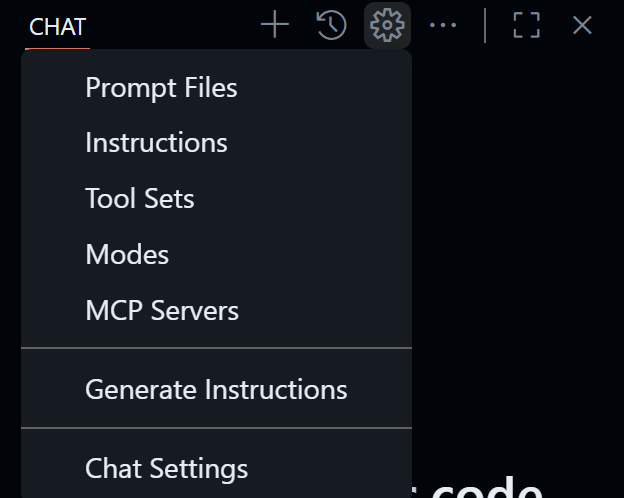
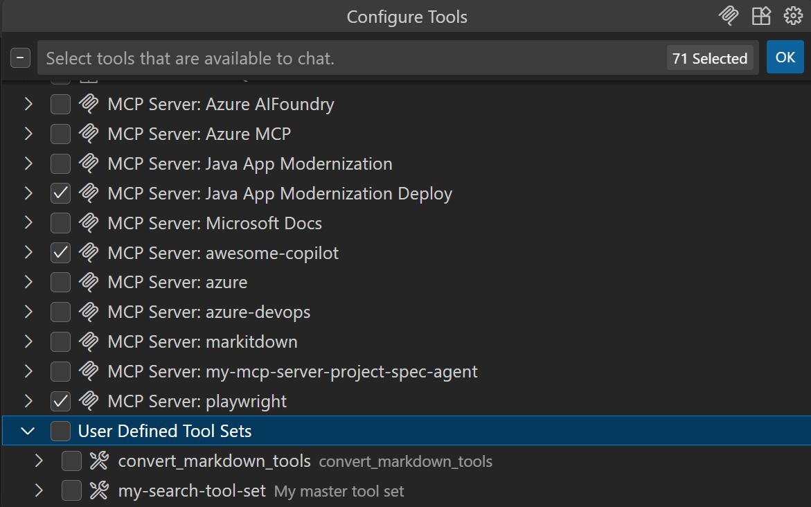

# 練習 3 - 使用指令檔案為 Copilot 提供上下文

| [← 上一課：模型上下文協定 (MCP)][previous-lesson] | [下一課：Copilot 代理模式 →][next-lesson] |
|:--|--:|

上下文在生活的許多方面都是關鍵，在與生成式 AI 工作時也是如此。如果您正在執行需要以特定方式完成的任務，或者一些背景資訊很重要，我們想確保 Copilot 能夠存取該資訊。我們可以使用[指令檔案][instruction-files]提供指導，讓 Copilot 不僅理解我們想要它做什麼，還理解我們希望如何完成。

在本練習中，您將學習如何：

- 使用自定義指令 **.github/copilot-instructions.md** 為 Copilot 提供專案特定的上下文、編碼指南和文件標準。
- 使用指令檔案指導 Copilot 進行重複性或範本化任務。
- 實作存儲庫範圍的指令和任務特定的指令。

## 情境

如同任何優秀的開發團隊，Tailspin Toys 有一套開發實務的指南和要求。這些包括：

- API 始終需要單元測試。
- UI 應該是深色模式並具有現代感。
- 文件應該以文件字串的形式添加到程式碼中。
- 應該在每個檔案的開頭添加一段註釋，描述檔案的作用。

透過使用指令檔案，您將確保 Copilot 擁有正確的資訊，以按照所強調的實務來執行任務。

## 開始之前

我們將進行一些程式碼變更，因此應該遵循我們的慣例，建立一個新分支來工作。這將允許我們進行變更而不影響主分支，直到我們準備就緒。

1. 從上一個練習返回您的 codespace。
2. 在您的 codespace 中選擇 <kbd>Ctl</kbd>+<kbd>\`</kbd> 打開新的終端視窗。
3. 透過在終端中執行以下命令來建立並切換到新分支：

   ```bash
   git checkout -b add-filters
   ```

## 自定義指令

自定義指令允許您為 Copilot 聊天提供上下文和偏好設定，以便它能夠更好地理解您的編碼風格和要求。這是一個強大的功能，可以幫助您引導 Copilot 獲得更相關的建議和程式碼片段。您可以指定您偏好的編碼慣例、函式庫，甚至您喜歡在程式碼中包含的註釋類型。您可以為整個存儲庫建立指令，或為特定類型的檔案建立任務級別的上下文。

有兩種類型的指令檔案：

- **.github/copilot-instructions.md**，一個針對**每個**聊天提示發送給 Copilot 的單一指令檔案。此檔案應包含專案級別的資訊，與每條訊息都相關的上下文。這可能包括正在使用的技術堆疊、正在建立的內容概述，或對 Copilot 的全局指導。
- **\*.instructions.md** 檔案可以為特定任務或檔案類型建立。您可以使用 **.instructions.md** 檔案為特定語言（如 Python 或 TypeScript）提供指南，或為建立 React 元件或存儲庫模式的新實例等任務提供指南。

> [!NOTE]
> 在您的 IDE 中工作時，指令檔案只用於 Copilot Chat 中的程式碼生成，不用於程式碼完成或下一個編輯建議。

## 在更新自定義指令之前使用 GitHub Copilot Chat

為了看到自定義指令的影響，我們將首先使用當前版本的檔案發送提示。然後我們將進行一些更新，再次發送相同的提示，並注意差異。

1. 返回到您的 codespace。
2. 關閉您的 codespace 中來自上一個練習的任何打開檔案。這將確保 Copilot 擁有我們希望它擁有的上下文。
3. 打開 `server/routes/publishers.py`，一個空檔案。
4. 如果 **Copilot chat** 尚未打開，通過選擇您的 codespace 頂部附近的 Copilot 圖示來打開它。
5. 通過在聊天視窗中輸入 `/clear` 並選擇 <kbd>Enter</kbd>（或在 Mac 上為 <kbd>return</kbd>）來建立新的聊天會話。
6. 從模式下拉選單中選擇 **Ask**。
7. 發送以下提示來建立一個返回所有發佈商的新端點：

   ```plaintext
   Create a new endpoint to return a list of all publishers. It should return the name and id for all publishers.
   ```

8. Copilot 探索專案以學習如何最佳實作程式碼，並生成建議清單，其中可能包括 `publishers.py`、`app.py` 的程式碼以及確保新程式碼正確執行的測試。
9.  探索程式碼，注意生成的程式碼包含 [型別提示][python-type-hints]，因為正如我們將看到的，我們的自定義指令包含包含它們的指示。
10. 注意生成的程式碼**缺少**文件字串或註釋標頭 - 或兩者都缺少！

> [!IMPORTANT]
> 如之前強調的，GitHub Copilot 和 LLM 工具是機率性的，不是確定性的。因此，生成的確切程式碼可能會有所不同，甚至有機會在我們不明確說明的情況下遵守我們的規則！但為了幫助程式碼的一致性，我們應該始終記錄任何我們希望確保 Copilot 應該了解的關於我們希望如何生成程式碼的內容。

## 將全域標準添加到 copilot-instructions.md

如之前強調的，`copilot-instructions.md` 旨在為 Copilot 提供專案級別的資訊。讓我們確保記錄全域編碼標準以改善來自 Copilot 聊天的程式碼建議。

1. 返回到您的 codespace。
2. 打開 `.github/copilot-instructions.md`。
3. 探索檔案，注意專案的簡要描述以及**程式碼標準**、**腳本**和**GitHub Actions 工作流程**的章節。這些適用於我們與 Copilot 的任何互動，是穩健的，並就我們正在做什麼以及我們想要如何完成它提供清晰的指導。
4. 找到**程式碼格式要求**章節，應該在第 16 行附近。注意它如何包含使用型別提示的註釋。這就是為什麼我們之前在生成的程式碼中看到這些的原因。
5. 在關於型別提示的註釋正下方（應該在第 18 行附近）添加以下 markdown 行，以指示 Copilot 向檔案添加註釋標頭和文件字串：

   ```markdown
   - Every function should have docstrings or the language equivalent
   - Before imports or any code, add a comment block that explains the purpose of the file.
   ```

6. 關閉 **copilot-instructions.md**。
7. 在 Copilot 聊天中選擇 **New Chat** 以清除緩衝區並開始新對話。
8. 返回到 **server/routes/publishers.py** 以確保正確設定焦點。
9. 發送與之前相同的提示來建立端點。

   ```plaintext
   Create a new endpoint to return a list of all publishers. It should return the name and id for all publishers.
   ```

10. 注意新生成的程式碼如何在檔案頂部包含註釋標頭，類似於以下內容：

   ```python
   """
   Publisher API routes for the Tailspin Toys Crowd Funding platform.
   This module provides endpoints to retrieve publisher information.
   """
   ```

11. 注意新生成的程式碼如何在函數內部包含文件字串，類似於以下內容：

   ```python
   """
   Returns a list of all publishers with their id and name.
    
   Returns:
      Response: JSON response containing an array of publisher objects
   """
   ```

12. 還要注意現有程式碼沒有更新，但當然我們可以要求 Copilot 執行該操作，如果我們想要的話！
13. **不要實作建議的更改**，因為我們將在下一節中這樣做。

> [!NOTE]
> 如果您接受了更改，您總是可以選擇 Copilot 聊天視窗右上角附近的**撤消**按鈕。

在這一節中，您探索了自定義指令檔案如何為 Copilot 提供了生成遵循既定指南的程式碼所需的上下文。

## 任務的指令檔案

編碼通常是重複性的，開發者定期執行類似的任務。Copilot 非常適合允許您卸載這些類型的任務。但這些類型的任務，如添加端點、建立元件或添加新服務模式實作，通常需要遵循特定的範本或結構。指令檔案允許您為這些類型的任務提供特定要求。在使用 Copilot Chat 時可以手動添加它們，或者可以在檔案頂部添加 **applyTo:** 標籤，讓 Copilot 自動為特定檔案使用它們。

我們想要建立一個新端點來列出所有發佈商，並遵循我們用於現有[遊戲端點][games-endpoints]的相同模式，並建立遵循現有[遊戲端點測試][games-tests]相同模式的測試。指令檔案已經建立；讓我們探索它並查看它生成的程式碼差異。

1. 打開 `.github/instructions/python-tests.instructions.md`。
2. 注意頂部的 `applyTo:` 區段，其中包含 `server/tests` 目錄中所有以 `test_` 開頭並具有 `.py` 擴展名的檔案的過濾器。每當 Copilot Chat 與符合此模式的檔案互動時，它將自動使用此檔案中提供的指導。
3. 注意檔案包含關於如何建立測試以及在測試資料庫功能時如何利用 SQLite 的指導。
4. 打開 `.github/instructions/flask-endpoint.instructions.md`。
5. 審查指令檔案內的以下項目，其中包括：

   - 要求概述，包括必須建立測試，以及使用藍圖在 Flask 中建立端點。
   - 連結到之前提到的 `python-tests.instructions.md` 檔案。
   - 連結到兩個遵循我們想要的模式的現有檔案 - 遊戲藍圖和測試。注意這些如何設定為普通的 markdown 連結，允許指令檔案合併其他檔案作為上下文。

6. 返回到 `server/routes/publishers.py` 以確保正確設定焦點。
7. 返回到 Copilot Chat 並選擇 **New Chat** 開始新會話。
8. 從模式下拉選單中選擇 **Edit**，這將允許 Copilot 更新多個檔案。

> [!NOTE]
> 如果您在本練習的這一部分執行測試時遇到任何問題，請撤消您的更改並使用 **Agent** 模式從上述步驟重試。

9. 選擇 **Add Context** 按鈕打開上下文對話框
10. 如果提示允許 codespace 查看複製到剪貼板的文字和圖像，選擇 **Allow**。
11. 從您的 codespace 頂部的下拉選單中選擇 **Instructions**。

> [!TIP]
> 如果選項清單很長，您可以輸入 **instructions** 來過濾到指令選項，然後選擇 **Instructions**。

12.  選擇 **flask-endpoint .github/instructions** 將指令檔案添加到上下文中。

   

13. 發送與之前相同的提示來生成所需的端點：

   ```plaintext
   Create a new endpoint to return a list of all publishers. It should return the name and id for all publishers.
   ```

14. 注意**References**區段以及它如何使用 **flask-endpoint.instructions.md** 檔案提供上下文。如果您將指令檔案與 Copilot 代理模式一起使用，您會注意到 Copilot 探索並讀取指令檔案中引用的檔案。

   

15. Copilot 生成檔案。注意它如何跨多個檔案生成更新，如 **publishers.py** 和 **test_publishers.py**

> [!NOTE]
> 注意生成的程式碼可能會偏離我們設定的一些標準。像 Copilot 這樣的 AI 工具是非確定性的，可能不會總是提供相同的結果。我們程式碼庫中的其他檔案不包含文件字串或註釋標頭，這可能會引導 Copilot 朝另一個方向。一致性是關鍵，所以確保您的程式碼遵循既定模式很重要。您總是可以在聊天中跟進並要求 Copilot 遵循您的編碼標準，這將幫助引導它朝正確的方向。

16. 審查程式碼後，在 Copilot Chat 中選擇 **Keep** 以接受更改。
17. 如果系統提示您執行測試，選擇 **Cancel**；我們稍後會執行此任務。
18. 通過選擇 <kbd>Ctl</kbd> + <kbd>\`</kbd> 打開終端視窗。
19. 通過使用以下命令執行腳本來執行測試：

   ```sh
   ./scripts/run-server-tests.sh
   ```

20. 一旦程式碼正確，所有測試通過，打開 Codespace 左側的 **Source Control** 面板並審查 Copilot 所做的更改。

> [!NOTE]
> 如果任何測試失敗，請 Copilot 建議修復。您可以使用 `@terminal /explain` 為 Copilot 提供終端視窗的上下文。

21.  通過選擇 **Source Control** 面板中的 **+** 圖示暫存更改。
22.  使用 **Sparkle** 按鈕生成提交訊息。


23.  通過選擇 **Commit** 將更改提交到您的存儲庫。

## 總結與下一步

恭喜！您探索了如何確保 Copilot 擁有正確的上下文來生成遵循您組織制定實務的程式碼。這可以在存儲庫層級使用 **.github/copilot-instructions.md** 檔案完成，或者在任務基礎上使用指令檔案完成。您探索了如何：

- 使用自定義指令 (.github/copilot-instructions.md) 為 Copilot 提供專案特定的上下文、編碼指南和文件標準。
- 使用指令檔案指導 Copilot 進行重複性或範本化任務。
- 實作存儲庫範圍的指令和任務特定的指令。

接下來，我們將使用[代理模式為網站添加功能][next-lesson]。

## 延伸應用

本章介紹如何將自定義指令與 Copilot Chat 更進階地結合於真實工作流程中，包含文件生產、Prompt 與指令檔案建立、工具集限制、聊天模式設定，以及推薦工具集。每一節都提供為團隊實作的具體建議與最佳實務，便於在專案中重複使用。

### 產生本機程式碼的最佳實踐文件
- 目的：將專案或團隊的實作慣例以「可機器讀取且可修改」的文件形式保存，讓 Copilot 在生成本機程式碼時能一貫遵循
- 實作步驟：
   1. 使用 Copilot Chat 右上角的 "Configure Chat..." -> "Generate Instructions"
   2. Review 產生的結果, 並加入 .github/copilot-instructions.md 中


### 產生 Prompt Files
- 目的：建立可複用的 prompt 模板或範本檔（例如 .prompt.md），以便團隊成員在 Copilot Chat 中快速引用或修改
- 範例用途：
   - 產生 Cloud-native 實作說明（Kubernetes 資源範本、Helm 範例）
   - 建立 API 端點模板、Svelte 元件骨架
- 實作步驟：
   1. 使用 Copilot Chat 右上角的 "Configure Chat..." -> "Prompt Files" -> "New prompt files" -> ".github/prompts/"，將常用 prompt 儲存為明確命名的檔案（例如 cloud-native.prompt.md）
   2. 在 prompt 中包含 context、輸入範例、輸出期望與驗收準則。
   3. 在 Copilot Chat 使用「Add Context」功能時，載入相應 prompt 檔案。
- 提示：為不同複雜度提供多個 prompt（基本/進階/測試），並在檔案頂端註明 applyTo 規則以便自動套用

### 產生 Instruction（指令檔案）
- 目的：針對常見任務或檔案類型建立 *.instructions.md，確保 Copilot 在編輯時自動採納團隊標準。
- 建議內容：
   - applyTo 規則（檔案路徑或副檔名過濾）
   - 必要步驟與驗收標準（包含測試要求）
   - 參考實作檔案或測試樣板連結
- 實作步驟：
   1. 使用 Copilot Chat 右上角的 "Configure Chat..." -> "Instructions" -> "New instruction files" -> ".github/instructions/"，將常用 instruction 儲存為明確命名的檔案（例如 csharp.instructions.md）
   2. 在 instruction 裡放入範例程式碼片段與測試範例連結，加速 Copilot 生成符合模式的程式
   3. 測試：在 Copilot Chat 中為符合 applyTo 的檔案觸發編輯，驗證生成內容符合標準
- 提示：保留一節「常見錯誤與修正」供 Copilot 在生成後自動檢查與修正

### 限定 Tool Sets 範圍
- 目的：明確告知 Copilot 在建議中應使用的 MCP Tool
- 實作步驟：
   1. 使用 Copilot Chat 右上角的 "Configure Chat..." -> "Tool Sets" -> "Create new tool sets files"
   2. 在 Configure Tool裡面選擇你的tool set config



### 設定 Chat Mode
- 目的：根據任務選擇合適的 Copilot Chat 模式（Ask、Edit、Explain、Agent 等），以取得最有效率的互動結果
- 實作步驟：
   1. 使用 Copilot Chat 右上角的 "Configure Chat..." -> "Modes" -> "Create new custom chat mode files..." -> ".github/chatmodes/"

### 使用 awesome-copilot
- 目的：整合社群或內部彙整的 Copilot 範例與資源（例如 awesome-copilot 類型的清單），加速團隊採用與最佳化
- 詳情請參考 [awesome-copilot-readme][awesome-copilot-readme]


## 資源

- [GitHub Copilot 自定義的指令檔案][instruction-files]
- [建立自定義指令的最佳實務][instructions-best-practices]
- [GitHub Copilot 的個人自定義指令][personal-instructions]

---

| [← 上一課：模型上下文協定 (MCP)][previous-lesson] | [下一課：Copilot 代理模式 →][next-lesson] |
|:--|--:|

[previous-lesson]: ./2-mcp.zh-TW.md
[next-lesson]: ./4-copilot-agent-mode-vscode.zh-TW.md
[instruction-files]: https://code.visualstudio.com/docs/copilot/copilot-customization
[python-type-hints]: https://docs.python.org/3/library/typing.html
[games-endpoints]: ../server/routes/games.py
[games-tests]: ../server/tests/test_routes/test_games.py
[instructions-best-practices]: https://docs.github.com/en/enterprise-cloud@latest/copilot/using-github-copilot/coding-agent/best-practices-for-using-copilot-to-work-on-tasks#adding-custom-instructions-to-your-repository
[personal-instructions]: https://docs.github.com/en/copilot/customizing-copilot/adding-personal-custom-instructions-for-github-copilot
[awesome-copilot-readme]: https://github.com/github/awesome-copilot/blob/main/README.md
[awesome-copilot-link]: https://github.com/github/awesome-copilot/tree/main
